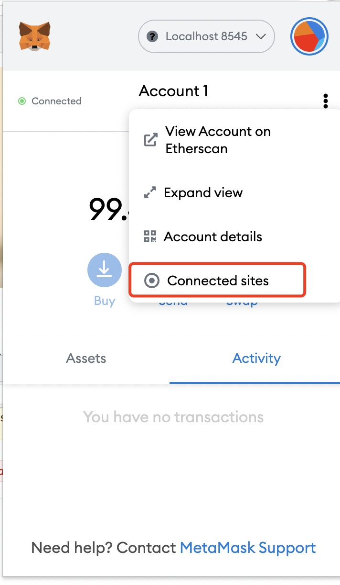

- 下载源码
  
```
mkdir pet-shop
cd pet-shop
truffle unbox pet-shop 
```

- 打开ganache 
- 打开metamask，设置网络为private

- 连接metamask 

- 


- 新建合约Adotion.sol,在remix编译通过

```
pragma solidity ^0.4.0;

contract Adoption{

    address[16] public pet;

    function adopt(uint petId ) public returns(uint){

      require(petId>=0 && petId <=15);
      pet[petId]=msg.sender;

      return petId;
    }


    function getAdopters() public view returns (address[16]){
       return pet ;
    }


}
```

- 部署,新建文件

```
cd migrations 
touch 2_adopt_migration.js 

var Adoption = artifacts.require("./Adoption.sol");

module.exports = function(deployer) {
  deployer.deploy(Adoption);
};


darren@darrendeMacBook-Pro pet-shop % truffle migrate                              

Compiling your contracts...
===========================
> Everything is up to date, there is nothing to compile.
Network up to date.


```

- 测试 

```
mkdir test
cd test 
touch TestAdotion.sol

pragma solidity ^0.4.0;

import "truffle/DeployedAddresses.sol";
import "truffle/Assert.sol";
import "../contracts/Adoption.sol";


contract TestAdoption{

    Adoption adoption= Adoption(DeployedAddresses.Adoption());

    // 测试领养函数
    function testAdoptPet() public {

        uint returnId= adoption.adopt(8);

        uint expected = 8;

        Assert.equal(returnId,expected,"pet id should be 8");

    }
}


// 测试

darren@darrendeMacBook-Pro pet-shop % truffle test                                 
Using network 'development'.


Compiling your contracts...
===========================
> Compiling ./test/TestAdoption.sol
> Artifacts written to /var/folders/yw/k_z0z4393mz698xzl0df6_t80000gn/T/test--93986-CvQGEtLyyPoa
> Compiled successfully using:
   - solc: 0.4.25+commit.59dbf8f1.Emscripten.clang


  TestAdoption
    ✓ testAdoptPet (181ms)


  1 passing (4s)


```

- 将/Users/darren/Documents/project/node/pet-shop/build/contracts/Adoption.json拷贝到/Users/darren/Documents/project/node/pet-shop/src/js文件夹中

- 修改js文件下的app.js，如源码。


- 执行项目，npm run dev 